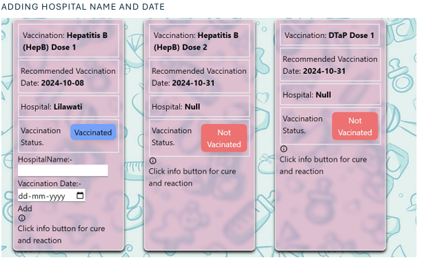
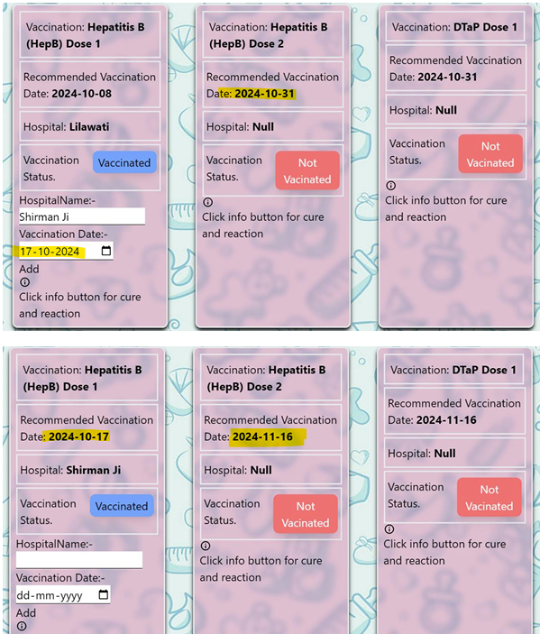
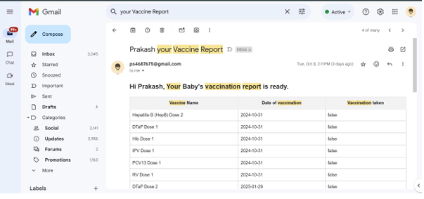
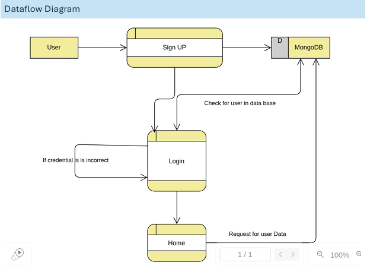

# Baby Vaccination Reminder App

## What made me do this 🤔?
Hi Myself Prakash Sharma, I was a Mtech student when I made this project. This project comes from an idea of how to track the vaccination schedules of a newborn, as vaccination is one of the most crucial parts of a baby's development. So I made this (haha), it was an idea of my Supervisor because I wanted to make an app for Stray animals but that's a different story.

## How to use it? 😁
### Now that's a million-dollar $ question. Just kidding, it is simpler than breathing now goto. 
#### SignUp Page (http://localhost:5173/signup) 
This will not work try it on your machine 😂😂😂

#### Login Page (http://localhost:5173/login)

### Now the best part
Welcome to Wonderland 😂. I mean the main page. oh did I forget to mention you will get a Sign up mail as well.

Now let me show you the thing for which you have been waiting for drum roll, please 

Okay okay Sorry here you go.

To basic right yup what you can expect from a non-artist guy but it is what it is.

* Now here we can see the list of vaccines
* Upcoming vaccination dates and list.
* and a tiny button to update the status.

Once you click on the wonder magic button it pop up few entries for you.

* Now here you have to give the hospital name from where you took the vaccine I mean your baby.
* And Date as well. That also will update the upcoming dates of vaccines as well if you took the vaccine on scheduled dates.

#### How will you be Reminded?
So, the purpose of the app is to remind parents and you must be asking Bro! how are u reminding parents?

So I have added a mail reminder to parents.
have a look!!!.

## Now let's do some technical Jargon.
#### Architecture Diagram

##### List of things on which the app is built.
* React
* Nodejs
* Mongo DB
* Tailwind CSS
* Express JS
* NodeMailer for sending mail via Gmail.

#### Dataflow Diagram.

#### Few more diagrams.

#### One more teeny tiny feature.
What if you need to search for a nearby hospital for babies? 
* Enter your pincode.

* Here you go list of nearby hospitals.

I'll write more jargon whenever I get time. or you like it write it from your side and help me make a clean and happy doc.

