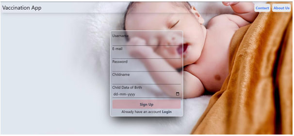
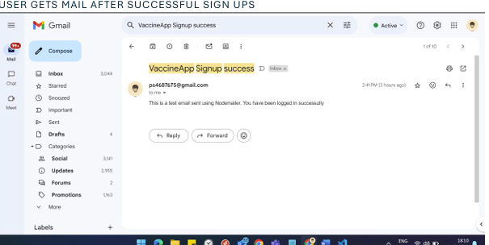
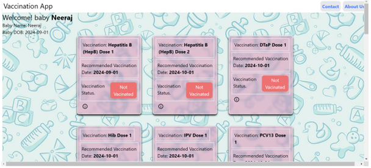
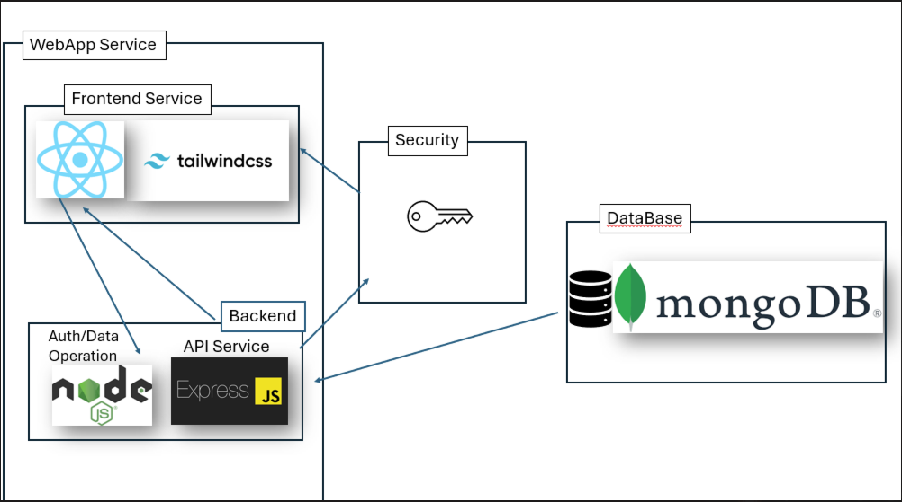
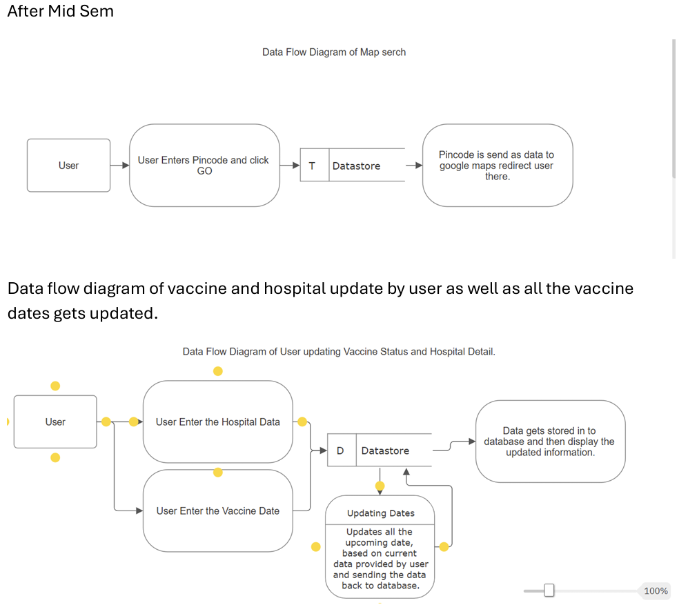
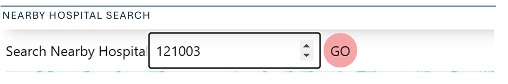
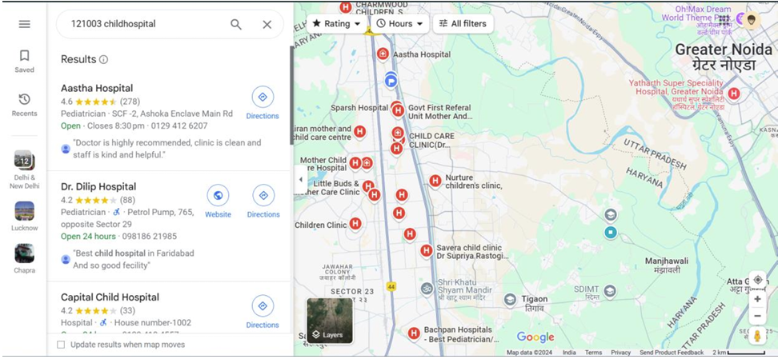

# Baby Vaccination reminder App

## What made me do this 🤔?
So Myself Prakash Sharma, I was an Mtech student when i made this project. This project comes from an idea on how to track vaccination schdeules of a newborn, as vaccination are one of the most crucial part for babies devlopement. So I made this (haha), it was an idea of my Supervisor, beacuse i wanted to make an app for Stray animals but that's a diffrent story.

## How to use it ? 😁
### Now that's a millon $ question. Just kidding , it is simpler then breathing goto 
#### SignUp Page (http://localhost:5173/signup) 
This will not work try it in your machine 😂😂😂

#### Login Page (http://localhost:5173/login)

### Now the best part
Welcome to wonderland 😂. I mean the main page. oh did i forget to mention you will get a Sign up mail as well

Now let me show you the thing for which you have been wating for drum roll please 

Okay okay Sorry here you go.

To basic right yup what you can expect from a non-artist guy but it is what it is.

* Now here we can see the list of vaccines
* Upcoming vaccination dates and list.
* and a tiny button to udpate the status.

Once you click on wonder magic button it pop up few entries for you.

* Now here you have to give hospital name from where you took the vaccine I mean your baby.
* And Date as well. And that also will update the upcoming dates of vaccines as well if you took vaccine on scheduled dates.

#### How will you be Reminded?
So, the purpose of app is to remind parent and you must be asking Bro! how are u reminding parents.

So I have added a mail reminder to parents.
have a look!!!.

## Now let's do some techincal Jargon.
#### Architecture Diagram

##### List of things on which app is built.
* React
* Nodejs
* Mongo DB
* Tailwind Css
* Express JS
* NodeMailer for sending mail via Gmail.

#### Dataflow Diagram.

#### Few more diagram.

#### One more teny tiny feature.
What if you need to search for an nearby hospital for babies. 
* Enter your pincode.

* Here you go list of nearby hospital.

I'll write more jargons whenever i get time. or you like it write it from your side and help me make a clean and happy doc.

